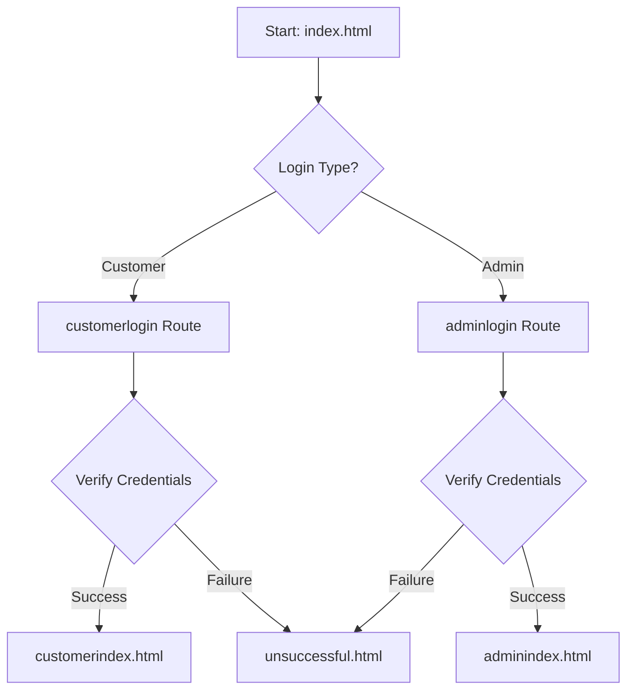
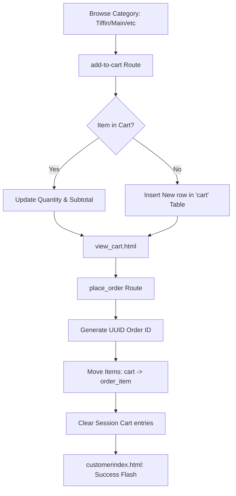
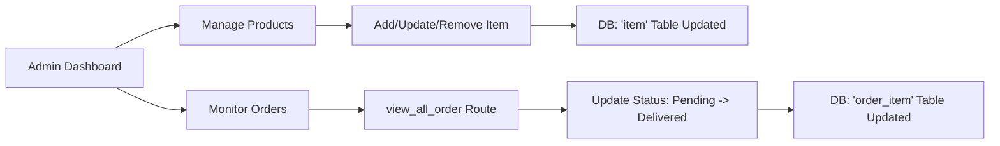

# Canteen Automation System: Technical Documentation

## 🌟 Executive Summary
The **Canteen Automation System** is a sophisticated Full-Stack web application engineered to transform traditional canteen operations into a high-efficiency digital environment. By leveraging the **Flask** micro-framework and a relational **MySQL** backend, it provides a distributed architecture for real-time order processing, inventory tracking, and customer engagement.

---

## 🛠️ Deep Technical Stack

| Layer | Technology | Utility |
| :--- | :--- | :--- |
| **Backend** | Python 3.x / Flask | Core business logic, routing, and server-side rendering. |
| **Database** | MySQL | Relational data storage with `PyMySQL` for connectivity. |
| **Frontend** | HTML5, CSS3, JS | Responsive UI utilizing Bootstrap 4.5 and FontAwesome. |
| **Auth** | Flask Session | Server-side session management for role-based access control. |
| **Security** | UUID | Unique identifier generation for non-sequential order tracking. |

---

## 📊 System Flowcharts

### 1. User Authentication Flow


### 2. Order Lifecycle Flow (Menu to Delivery)


### 3. Admin Inventory & Order Fulfillment


---

## 🔄 Operational Workflows

### 1. Customer Acquisition & Ordering
- **Authentication**: Redirects to a unified login portal where `usertype` check determines session context.
- **Dynamic Menu Discovery**: The system queries the `item` table based on categories (Tiffin, Main Course, etc.) and availability status.
- **Stateless Cart logic**: Items are added to a `cart` table in MySQL, allowing for cross-device persistence within the same database environment.
- **Entropy-linked Ordering**: Upon checkout, the system generates a 6-character UUID prefix to serve as a human-readable but unique `order_id`.

### 2. Administrative Control & Fulfillment
- **Inventory CRUD**: Admins have full lifecycle control over items—creation, real-time price updates, and logical deletion (setting status to 'notavailable').
- **Real-time Queue Monitoring**: The internal `admin_view_order` route filters today's transactions that are not yet flagged as 'delivered'.
- **State Transitioning**: Admins can promote order states (Pending -> Processing -> Delivered), triggering immediate updates in the customer's dashboard.

---

## 🗺️ Extended Route Specification (API Map)

### 🔐 Authentication & Session
- `POST /customerlogin`: Validates credentials against `login_data`. Sets `session['username']`.
- `POST /adminlogin`: Validates admin privileges.
- `GET /logout`: Destroys active session and redirects to entry point.

### 🍴 Menu & Catalog
- `GET /tiffinmenu`, `/maincoursemenu`, etc.: Fetches available items filtered by category.
- `GET /admin-menu`: Specialized view for admins showing both available and out-of-stock items.

### � Transactional Logic
- `POST /add-to-cart`: Handles quantity increments and subtotal calculations via SQL `UPDATE` or `INSERT`.
- `POST /place_order`: Orchestrates a multi-step transaction:
    1. Transfers items from `cart` to `order_item`.
    2. Assigns a timestamp and UUID.
    3. Flushes the active user's cart entries.
- `GET /view_order`: Context-aware query fetching orders tied to the logged-in `user_id`.

### ⚙️ System Administration
- `POST /add-products`: Implements data persistence for new catalog items.
- `POST /update_status`: High-privilege route to modify state within the `order_item` table.

---

## 💾 Database Logic & Schema Details

Connecting to: `localhost` | User: `root` | Database: `vthsem`

### 📊 Table: `item`
| Column | Type | Description |
| :--- | :--- | :--- |
| `id` | INT (PK) | Unique product identifier. |
| `name` | VARCHAR | Display name of the food item. |
| `price` | FLOAT | Unit price. |
| `category` | VARCHAR | tiffin, maincourse, snack, juice. |
| `status` | VARCHAR | available, notavailable. |
| `img` | TEXT | URL to product imagery. |

### 📈 Table: `order_item`
| Column | Type | Description |
| :--- | :--- | :--- |
| `id` | INT (AI) | Internal tracking ID. |
| `order_id`| VARCHAR | 6-character UUID string. |
| `user_id` | VARCHAR | FK linking to the username. |
| `name` | VARCHAR | Item name at time of purchase. |
| `amount` | FLOAT | Total cost for the line item. |
| `date` | DATE | System-stamped transaction date. |
| `status` | VARCHAR | pending, delivered, rejected. |

---

## 🚀 Deployment & Scaling Guide

### Prerequisites
1. **Python Environment**: Ensure `pip` is updated.
2. **Database Engine**: MySQL Server 8.0+ suggested.

### Environment Setup
```bash
# Clone the architecture
git clone https://github.com/vaddidharmateja/Canteen-Automation-System.git
cd "Canteen Automation System Using Flask"

# Dependency Injection
pip install flask pymysql
```

### Database Initialization
Execute the following DDL in your MySQL terminal:
```sql
CREATE DATABASE vthsem;
USE vthsem;

CREATE TABLE login_data (username VARCHAR(50), password VARCHAR(50), usertype VARCHAR(20));
CREATE TABLE item (id INT PRIMARY KEY, img TEXT, name VARCHAR(100), price FLOAT, category VARCHAR(50), status VARCHAR(20));
-- Additional tables: cart, order_item
```

### Execution
```bash
python app.py
```
*The server initializes on `http://localhost:5000` with debugger mode enabled.*

---

## �️ Security Observations
- **Session Privacy**: Uses server-side sessions to prevent client-side state tampering.
- **Relational Integrity**: Transactional order logic ensures no data loss during the Cart -> Order handover.

### 📈 Future Roadmap
- **Bcrypt Hashing**: Upgrading plain-text password storage to industry-standard hashes.
- **Recommendation Engine**: Utilizing NLP or Content-Based filtering on the `category` and user history metadata.
- **Analytics View**: Adding Matplotlib or Chart.js for admin sales visualization.

---
**Core Developer:** [Dharma Teja](https://github.com/vaddidharmateja)  
**Project Context:** V-Semester Engineering Thesis Project
